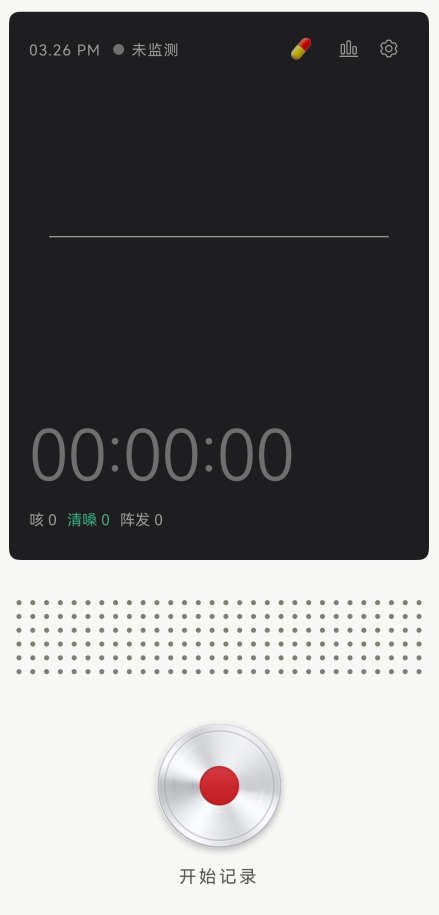
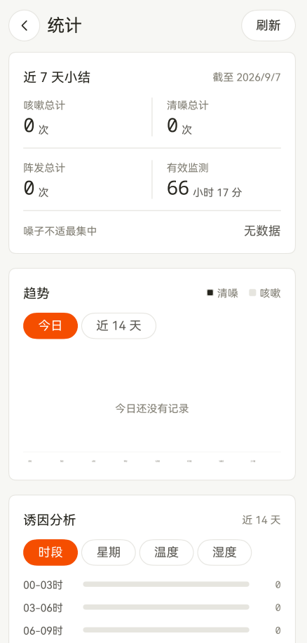
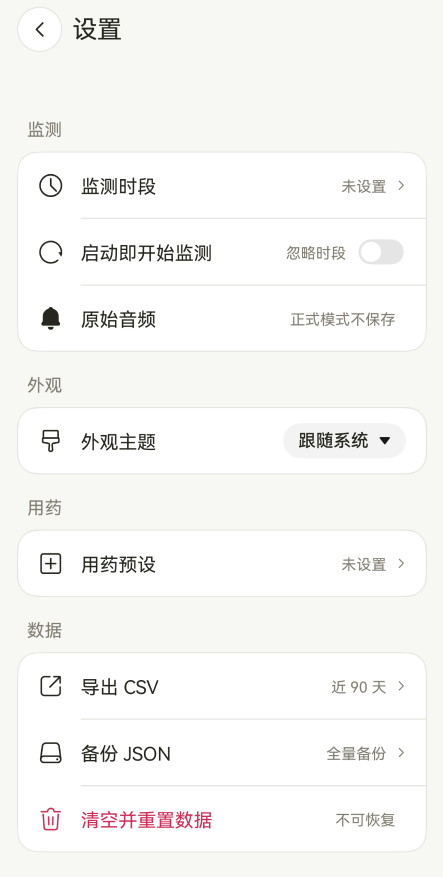

# 嗓子不适监测 (cough-sense)

HarmonyOS 原生应用。用麦克风持续监听，自动识别并记录**咳嗽**与**清嗓**事件，在本地形成可复查的时间线，并关联当时的天气与用药记录。

界面上只有一件事要做：开关监测。它想做的是一台安静工作的床头仪器，不是一个提醒你生病的健康 App。

<p align="center">
  
  
  
</p>

> **免责声明**：本项目不是医疗器械，不用于诊断、治疗或预防任何疾病。识别结果是启发式声学分类，存在漏记与误记，仅供个人趋势参考。如有健康问题请咨询医生。

## 隐私设计

这个应用需要持续录音，所以隐私边界是设计约束，不是附加说明：

- **原始音频默认不落盘**。`entry/src/main/ets/config/AppConfig.ets` 中 `CLIP_ENABLED = false`；只有在设置里显式开启校准模式，才会保存触发前 2 秒、触发后 1.5 秒的片段，用于人工核对识别效果。
- **全部数据只存本机**。事件、会话、天气快照、用药记录都写在应用沙箱内的关系型数据库里，没有账号体系，没有云同步，没有上报。
- **联网只做一件事**：向 [Open-Meteo](https://open-meteo.com/) 查询当前天气（无需 API key），用于分析温湿度与嗓子不适的关联。

申请的权限与用途一一对应：

| 权限 | 用途 |
| --- | --- |
| `ohos.permission.MICROPHONE` | 持续采集声音以识别咳嗽与清嗓 |
| `ohos.permission.KEEP_BACKGROUND_RUNNING` | 锁屏或退到后台时不中断录音，保证夜间数据完整 |
| `ohos.permission.APPROXIMATELY_LOCATION` | 取大致位置查询当地天气，仅用于诱因分析 |
| `ohos.permission.INTERNET` | 仅访问天气接口 |

## 识别算法

音频链路是 16 kHz 单声道 PCM，按 320 采样（20 ms）分帧，512 点 FFT。三个检测器分工，由 `MonitorController` 编排：

- **`SpectrumGate`** — 频谱预门。用高频（>2 kHz）能量占比和过零率快速排除明显不像人声的帧，省掉后续计算。
- **`ThroatDetector`** — 包络与阈值检测，负责事件的起止边界和「阵」（bout）归组。昼/夜各有一套阈值参数（`DEFAULT_DAY` / `DEFAULT_NIGHT`），夜间环境底噪低，灵敏度相应提高。
- **`HumanSoundDetector`** — 分类器（当前版本 `human-acoustic-v5`）。逐帧提取 RMS、过零率、低/中/高频能量占比、频谱质心、平坦度、周期性、频谱通量、削波比等特征，判定 `cough` 还是 `throat_clear`；对不上任一轮廓的事件**直接丢弃**，不默认归类。

几个关键取值：启动后有 1.5 秒底噪学习期不计次；触发门限约 -40 dBFS 且需高出底噪约 12 dB，避免把环境噪声记成咳嗽；事件结束后 200 ms 冷却，不吞掉连发的清嗓。

每个事件都会带上质量标记（削波、信噪比过低、过短、过长、纯音性、撞击声、疑似语音、模糊），写入数据库时一并保存算法版本号，便于回溯不同版本下的记录差异。

## 数据结构

本地数据库 `throat.db`，定义见 `entry/src/main/ets/data/DbManager.ets`：

| 表 | 内容 |
| --- | --- |
| `throat_event` | 单次咳嗽/清嗓事件：时间、时长、峰值分贝、分类置信度、质量标记、算法版本、所属阵 |
| `listen_session` | 一次监测会话的起止 |
| `weather_snapshot` | 会话期间的温湿度与天气码快照 |
| `medication_log` | 手动记录的用药 |
| `settings` | 应用内设置项 |

设置页提供两种导出：CSV（每条事件一行，附就近的天气上下文）和 JSON 全量备份，都写入应用沙箱的 `filesDir/export/`。实现见 `entry/src/main/ets/export/DataExporter.ets`。

## 项目结构

```
AppScope/                     应用级配置与图标
entry/src/main/
  ets/
    audio/                    AudioCapturer 采集与回调分发
    monitor/                  MonitorController：会话生命周期、检测器编排、后台常驻任务
    detector/                 SpectrumGate / ThroatDetector / HumanSoundDetector
    detection/                事件与质量标记的类型定义
    clip/                     校准模式下的片段录制与回放（默认关闭）
    data/                     DbManager：建表、迁移、读写
    stats/                    统计聚合
    weather/                  Open-Meteo 查询与坐标缓存
    export/                   记录导出
    task/                     后台持续任务申请
    theme/                    配色、间距、圆角 token 与主题切换
    components/               按键、页签图标、遮罩等 UI 构件
    view/                     首页 / 统计 / 设置三个页面
    pages/                    Navigation 路由入口
  module.json5                模块与权限声明
  resources/                  图标、字符串、颜色
scripts/                      离线自检脚本
screenshots/                  README 用的界面截图
```

约 5600 行 ArkTS，`oh-package.json5` 中 `dependencies` 为空——只用系统 API，没有第三方依赖。

## 命名说明

仓库里有四个名字指向同一个应用，各有来历：

| 位置 | 名称 | 说明 |
| --- | --- | --- |
| 仓库 slug | `cough-sense` | 遗留名。项目起点是「咳嗽计数」，后来扩展到清嗓等嗓子不适事件，仓库名没跟着改。 |
| `oh-package.json5` 的 `name` | `throatmonitor` | 包名，对应口径扩展后的定位。 |
| `AppScope/app.json5` 的 `bundleName` | `com.kesou.sense` | 应用身份。已从 `com.kesou.cough` 改为 `com.kesou.sense` 与项目新口径一致；HarmonyOS 按 bundleName 隔离数据沙箱，老用户升级后会按新包名安装，历史 `throat.db` 留在旧沙箱读不到（首次发布即改，影响很小）。 |
| 应用标签 | 嗓子不适监测 | 桌面图标下的名字，定义在 `AppScope/resources/base/element/string.json`。 |

## 构建与运行

环境要求：

- DevEco Studio（HarmonyOS NEXT）
- `compatibleSdkVersion` 5.0.0(12)，`targetSdkVersion` 26.0.0
- 真机（`deviceTypes` 仅 `phone`）

步骤：

1. 用 DevEco Studio 打开项目根目录，等待依赖同步完成。
2. 配置签名：`File > Project Structure > Signing Configs`，勾选自动生成调试证书。仓库中 `build-profile.json5` 的 `signingConfigs` 是空数组，**不包含任何证书或口令**，每个开发者需在本机自行生成。DevEco 会把生成的证书路径与口令写回 `build-profile.json5`，**这个文件不要提交**：本仓库已对它执行 `git update-index --skip-worktree build-profile.json5`，本地改动不会出现在 `git status` 里，CI 也会拦截任何带口令字段的提交。若确实需要修改并提交这个文件，先 `git update-index --no-skip-worktree build-profile.json5`。
3. 连接真机运行。

命令行构建（不依赖 IDE 界面）：

```bash
export DEVECO_SDK_HOME="/path/to/DevEco Studio/sdk"
export JAVA_HOME="/path/to/DevEco Studio/jbr"
"/path/to/DevEco Studio/tools/hvigor/bin/hvigorw" assembleHap --no-daemon
```

未配置签名时产物是 `entry-default-unsigned.hap`，不能直接安装。

> 注意：模拟器的 `requestPermissionsFromUser` 不会弹权限框，会直接以「拒绝」返回。涉及麦克风授权、后台录音的行为**必须在真机验证**。

## 离线自检

`HumanSoundDetector` 的类型标注可以被剥掉后在 Node 里直接跑，用于在没有设备的情况下验证分类逻辑改动：

```bash
node scripts/test-human-detector.mjs
```

## CI

`.github/workflows/ci.yml` 在 push 与 PR 上跑两个 job：

- **仓库卫生**：确认 `build-profile.json5` 的 `signingConfigs` 是空数组、没有证书/密钥库/构建产物被 Git 跟踪、源码里没有 `keyPassword` / `storePassword` 字段。这道守卫是为了防止本地签名口令再次被提交进来。
- **识别算法离线自检**：跑上面那个脚本。

HarmonyOS SDK 在 GitHub 托管 runner 上不可用，所以 **CI 不编译 ArkTS**，也不打包 `.hap`。CI 能拦住的只有上面两类问题，界面与录音链路的正确性仍需在本地 DevEco Studio 和真机上验证。

## 已知限制

- 识别是启发式的，对说话、笑声、撞击声、犬吠等仍可能误判；质量标记只能标记可疑，不能消除误判。
- `build-profile.json5` 声明的 `compatibleSdkVersion` 是 5.0.0(12)，但 `pages/Index.ets` 用到了 `systemMaterial` 与 `barFloatingStyle`（SDK 26.0.0 起支持），构建会报兼容性警告。低于 API 26 的设备上沉浸材质效果不会生效，建议用 `apiAvailable` 做降级判断。
- 没有单元测试框架，CI 也只覆盖离线自检与仓库卫生；ArkTS 编译、界面渲染和录音链路的回归只能靠真机手工验证。
- 只适配手机，未做平板与折叠屏布局。
- 长时间监测的耗电未做系统性优化，仅通过降低定位频率（复用上次坐标）和频谱预门减少开销。

## License

[MIT](LICENSE)
